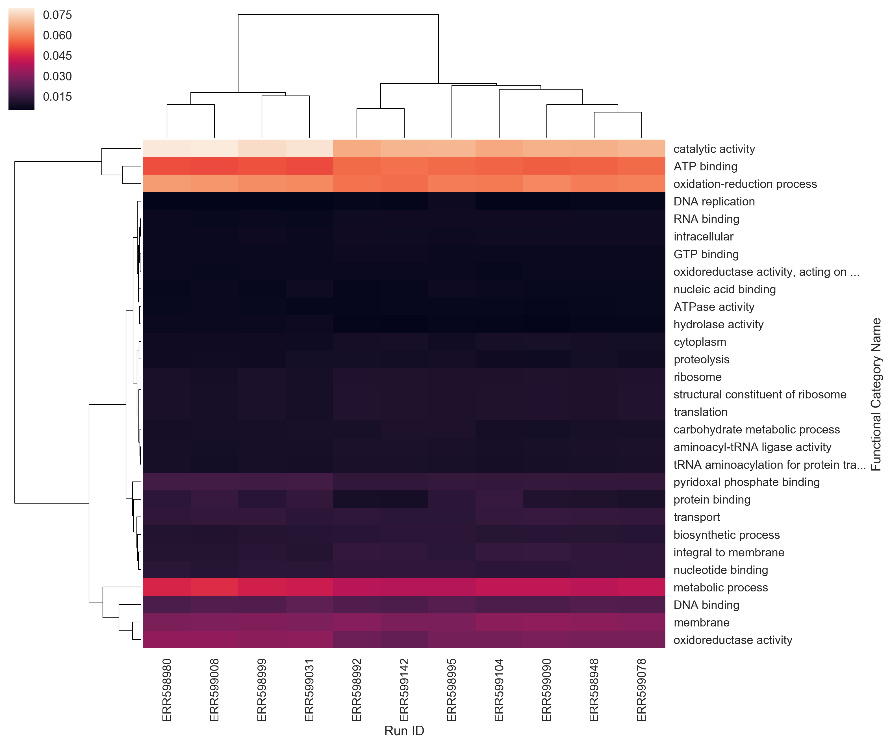
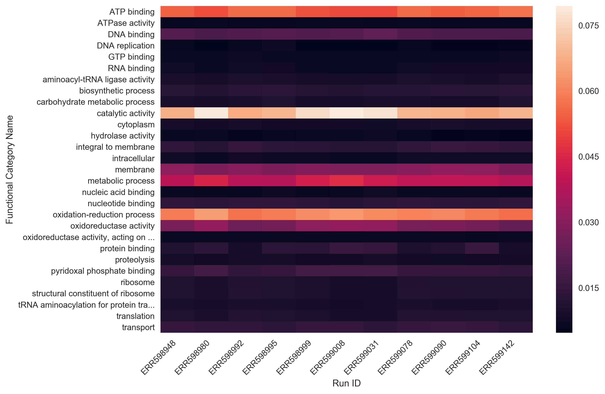

## Abstract

This is text that I'm writing and there's lots in there and that's cool!

## Introduction

Lorem ipsum dolor sit amet, consectetur adipisicing elit, sed do eiusmod
tempor incididunt ut labore et dolore magna aliqua. Ut enim ad minim veniam,
quis nostrud exercitation ullamco laboris nisi ut aliquip ex ea commodo
consequat. Duis aute irure dolor in reprehenderit in voluptate velit esse
cillum dolore eu fugiat nulla pariatur. Excepteur sint occaecat cupidatat non
proident, sunt in culpa qui officia deserunt mollit anim id est laborum.

Lorem ipsum dolor sit amet, consectetur adipisicing elit, sed do eiusmod
tempor incididunt ut labore et dolore magna aliqua. Ut enim ad minim veniam,
quis nostrud exercitation ullamco laboris nisi ut aliquip ex ea commodo
consequat. Duis aute irure dolor in reprehenderit in voluptate velit esse
cillum dolore eu fugiat nulla pariatur. Excepteur sint occaecat cupidatat non
proident, sunt in culpa qui officia deserunt mollit anim id est laborum.

## Another section

1. item
1. item
    1. item
1. item

## A quote that is nice.

> Research is what I'm doing
when I don't know what I'm doing.
- Wernher von Braun

# Here's another section

Here is a citation [@sunagawa_structure_2015].

## A Figure

This is a figure.

## Equations

Inline equations $\pi$

Block equations

$$
\pi = 3.14
$$ {#eq:pi}

## A Figure

{#fig:cluster_all}

{#fig:heat_all}

# References
