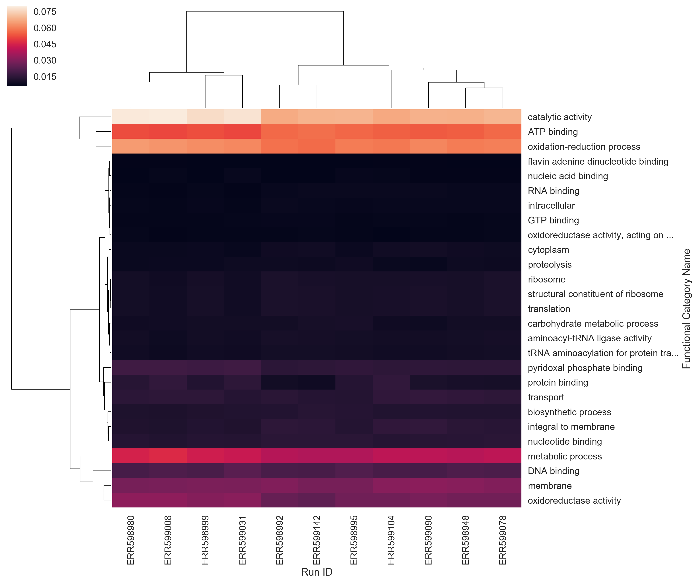
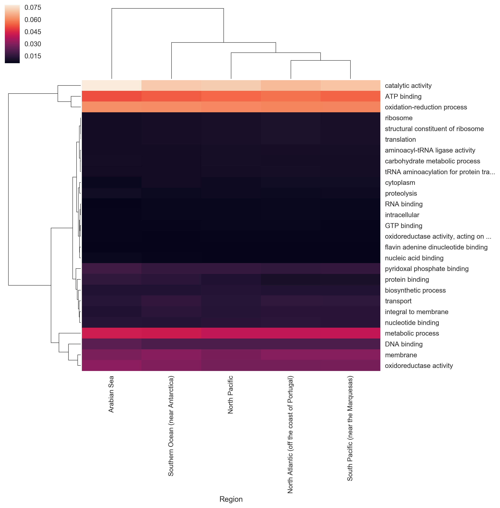
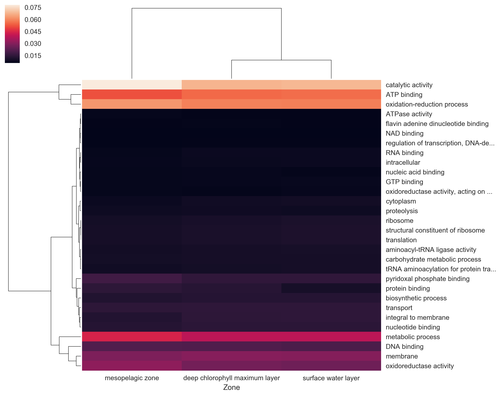

# Abstract

No abstract yet...

# Introduction

This project is inspired by the paper "Structure and function of the global ocean microbiome" by Sunagawa et al. [@sunagawa_structure_2015], as well as the paper "An obesity-associated gut microbiome with increased capacity for energy harvest" by Turnbaugh et al. [@turnbaugh_obesity-associated_2006]. The first paper seeks to characterize staxonomic differences and differences in gene function between ocean microbiomes, using Tara Ocean samples from around the world. They seek to identify which factors could best explain that variation. The second paper, by Turnbaugh et al., at one point describes the differences between the distal gut microbiomes of mice using functional annotations of the various microbiomes, and visualizes the result using heat maps.

My goal in this paper was to employ some of the tactics of the Turnbaugh et al paper-- understanding the functional differences between metagenomes using heat maps-- to the domain of the Sunagawa et al. paper, characterizing functional differences between ocean regions.

One thing to note: I am interested in the challenge of ensuring reproducibility in bioinformatics projects, and have attempted to structure this investigation for maximum reproducibility. Namely,

* All files are being stored (at various stages) using a public GitHub repository (See: <https://github.com/dustinmichels/biol338-final-project/tree/master>). The code associated with this draft is tagged as "draft01" and be retrieved in its entirety from GitHub.
* I am attempting to carry out most stages of data collection, analysis, and presentation, using scripts that should be viable to re-run on other machines at other times to generate the same results. Even this report is being written in plain-text (Markdown) and converted into a report using a tool called Pandoc!
* Finally, I am taking care to document the software I am using, and which version I am using, and how I am using it.

# Methods

I have used the eleven Tara Ocean samples that our class has used throughout the term, but I have downloaded Gene Ontology (GO) files for each dataset, which detail the number of reads from that dataset that mapped to each of about 2000 different functional categories, pertaining to molecular function, cellular components, or biological processes.

For each dataset, I normalized the 'read count' into a 'read proportion' (the number of reads that mapped to a given functional category out of all the reads.) I then selected the top 30 most abundant functional categories, for each dataset. I ended up dropping three of these functional categories from my analysis, which had missing data for one or more samples. That is to say, I wound up plotting the *union* of the 30 most abundant functional groups from each sample, which is 27 functional groups.

I created three heat maps, one for all eleven samples, one grouped by region, and one grouped by zone.

I then created three "cluster maps." A cluster map is similar to a heat map, except it clusters data hierarchically. It calculates pairwise Euclidean distance between observations in n-dimensional space, and groups closely related attributes together. It rearranges data accordingly, and even draws tree structures resembling phylogenies to indicate groupings. This method produced pretty interesting results, but I will need to further investigate exactly how this works to ensure the results are meaningful.

The exact steps I took to do this analysis can be seen and reproduced on-line at <http://bit.ly/2zEMitP>.

# Results

Here are the heat maps and cluster maps that I generated.

{#fig:heat_group}

{#fig:cluster_all}

{#fig:cluster_region}

{#fig:cluster_zone}

# Discussion

The cluster maps seem to suggest that deep chlorophyll maximum layer and the surface water later are more closely related to each other, in terms of prevalence of functional gene categories, prevalence than either is to the mesopelagic zone 

Similarly, the cluster maps would suggest that the North Atlantic and South Atlantic are the most functionally similar, followed by the North Pacific, followed by the Souther Ocean, and finally the Arabian Sea.

More analysis underway!

# References