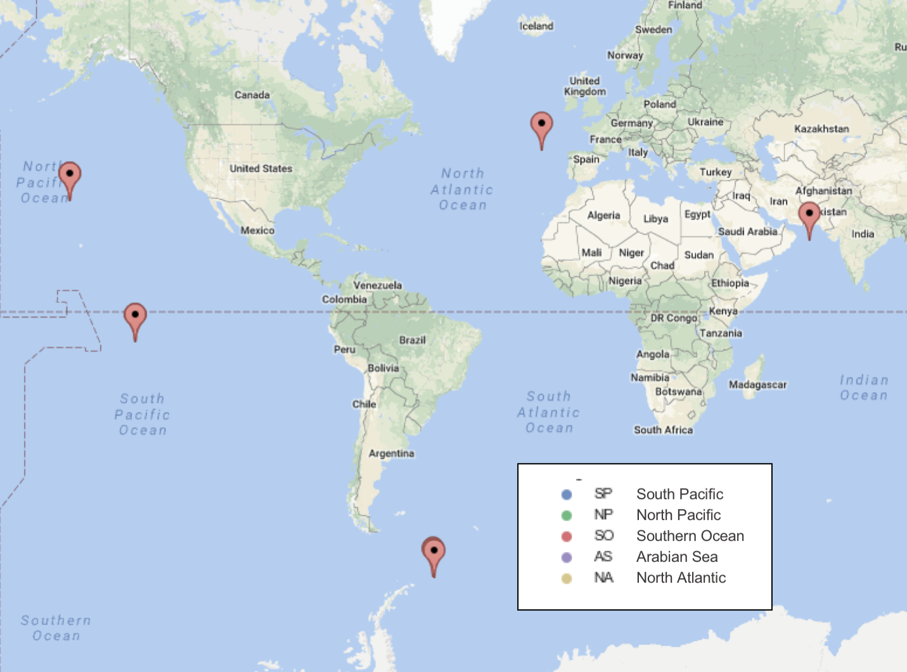

# Abstract

Microbial communities can be characterized by their taxonomic makeup, but some argue that looking at which functions are coded for in the genes of the microbial community as a whole can be more insightful. This is partly because the exact definition of a taxonomic classification for microbial life is a bit hazy, and partly because microbial communities that are very different taxonomically can be functionally very similar and occupy a similar environmental niche. This paper shows that taxonomic data can indeed be ‘nosier’ and reflective of sample site than functional data. Additionally, the paper investigates whether geographical or environmental factors drive community composition more strongly, by seeing how sample region (geography) and zone (environmental) correlate to taxonomy and function of microbiomes. We show that zone is indeed a better proxy of environmental forces than geography, and that it does indeed appear to drive microbial community composition more strongly.

Please note, all relevant files needed to reproduce this analysis are available on GitHub: <https://github.com/dustinmichels/biol338-final-project/tree/master>. Even the report itself can be generated, in several formats, by navigating to the `report/` directory and typing `make`.

# Introduction

There are particular considerations that arise when dealing with microfauna, as compared to larger life forms. In order to compare biological communities of macroorganismal organisms, for instance, one might compute metrics of species diversity. In microbiological communities however, species are harder to define– in part because of the frequency with which horizontal gene transfer occurs. Some have suggested we should shift our focus away from the notion of species and towards distributions of genes to effectively characterize and compare microbial communities. [@omalley_everything_2008].

Various authors have observed that taxonomic composition reveals less about the particular physicochemistry of an ecosystem than differences in functional composition [@louca_decoupling_2016]. In human guts [@consortium_structure_2012] and in oceans [@sunagawa_structure_2015] alike, authors have observed "functional redundancy" in that that microbial communities can be very different taxonomically, can still have very similar functional genomes. This leads to the idea that functional diversity is a more meaningful indicator of the true difference between groups [@louca_decoupling_2016].

Furthermore, while geographic isolation is considered a major factor in determining the distinctiveness of macroorganismal populations, microbiology has long entertained the hypothesis that "everything is everywhere: but the environment selects"-- articulated by Lourens G. M. Baas Becking in 1934 [@omalley_everything_2008]. Though that idea has recently become more contested [@martiny_microbial_2006], there is still good evidence that environmental factors-- rather than geographic dispersal-- play a key role in determining the constitution of microbial communities [@omalley_everything_2008] [@sunagawa_structure_2015].

This paper will seek to examine these four axes (taxon vs. function, & environment vs. geography) to see what they can reveal about ocean microbial community. We will first characterize taxonomic and functional diversity across eleven disparate metagenomic samples, and evaluate evidence of functional redundancy. We will then investigate environmental drivers of taxonomic and functional diversity, and especially whether environmental or geographic factors play a more important role. It is expected that functional redundancy will observable, and that environmental factors will prove a better differentiator of both functional and taxonomic diversity than geographic location.

# Materials & Methods

## Data Gathering

Eleven Tara Ocean DNA samples, from five different regions and three different zones were used in this analysis. The samples were shotgun sequenced, typically with an Illumina HiSeq 2000, and their sequences along with various metadata and analysis files were made available on EMBL-EBI (<https://www.ebi.ac.uk>).

{#fig:map}

To conduct functional analysis, I downloaded the "Complete GO annotation" file for each sample, from EMBL-EBI. This contains Gene Ontology (GO) terms derived from InterPro matches to the given sample. GO is a database of gene functions maintained by the GO Consortium (<http://www.geneontology.org/>).

To conduct taxonomic analysis, I downloaded the "Reads encoding 16S rRNA" file for each sample, from EMBL-EBI. These are FASTA files, which were merged together and classified against the SILVA database, using Mothur (version 1.38.1) [@schloss_introducing_2009]. Notes on exact commands executed are available at <https://github.com/dustinmichels/biol338-final-project/tree/master/data/taxonomy>.

## Data Analysis

For both functional and taxonomic datasets, counts were normalized into percentages of reads mapping to a given group, within a given sample. Analysis focused on a superset of the $n$ most abundant groups from each sample-- the 25 most abundant functional groups, and the 10 most abundant taxonomic groups. These numbers where chosen so that most of the diversity would be captured (greater than 50% of all the taxonomic or functional groups) while minimizing the long tail of groups present only in trace amounts, which make the significant values harder to distill. Taxonomic analysis was performed at both the actual level of 'taxonomy' (level2 in the mothur output) and also at the level of classes of phyla (level3 in mothur output.)

Heatmaps and clustermaps were generated to characterize structural and functional diversity, across samples, regions, and zones. Principal component analysis (PCA) was conducted to highlight which samples were most distinct, and PC1 was plotted against other metadata to determine if any were strongly correlated, indicating a potential driver of diversity. Finally, scatterplot matrices were constructed to illustrate the relationships between all the metadata and how they relate to ocean regions and zones, to better contextualize analysis.

A variety of data-munging, statistical analysis, and plotting techniques were applied to the data using Python and tools from the SciPy ecosystem [@scipy]. All plotting was done with the Matplotlib and Seaborn Python libraries [@hunter_matplotlib:_2007]. PCA and Linear Regression were conducted using scikit-learn [@pedregosa_scikit-learn:_2011].

# Results

**Heat maps.** To characterize structural and functional diversity, heat maps and cluster maps were constructed, providing an overview of which functional and taxonomic groups were most abundant, and how different samples varied in their relative abundances. The visualizations showed catalytic activity, ATP binding, and oxidation-reduction process genes to be particularly abundant, followed by metaboloic process, DNA binding, membrane, and oxidoreductase activity genes. As for functional groups: in their survey of the global ocean microbiome, @sunagawa_structure_2015 Sunagawa et al., noted that several classes of Proteobacteria, including Alphaproteobacteria and Gammaproteobacteria, as well as Cyanobacteria, Deferribacteres, and Thaumarchaeota were especially abundant. This is consistent with our findings here, except perhaps that Thaumarchaeota was not particularly abundant.

{#fig:cluster}

The hierarchal clustering of the cluster maps indicates which samples and attributes are most closely related. The tactic computes euclidean distance between rows and columns then rearranges them by closeness. In both taxonomic and structural analysis, the mesopelegic zone was categorized as especially distinct from the DCM and SURF. Surface and DCM samples do not appear to be grouped in any discernible pattern. These maps also provide evidence of
functional redundancy, in that the functional maps are very "smooth," reflecting fairly consistent levels of each functional group across samples and regions, whereas the taxonomic maps, which appear more "pixilated" because there is more variability. This effect could be slightly exasperated by the fact that fewer attributes appear on the y-axis, and a more rigorous selection of how many values to plot on each axis would have been ideal.

**Principal component analysis.** To investigate the value of taxonomic vs. functional annotations in assessing the differences between microbial communities, principal component analysis was performed. For both taxonomic and functional plots: when points are colored by zone, there is clear clustering of the mesopelegic samples together, but when clustered by region there is no discernible pattern. This suggests that ocean layer is more tightly related to functional composition than region (see: +@fig:go_pca and +@fig:tax_pca).

{#fig:go_pca}

{#fig:tax_pca}

In the paper 'Structure and function of the global ocean microbiome'[@sunagawa_structure_2015], Sunagawa et al., plotted a number of metadata variables against a values derived from a principal coordinate analysis (PCoA) of taxonomic data. They found that temperature and dissolved oxygen were especially highly correlated, while nutrients has only a weak correlation. Similarly, I tried plotting a single PC axis against various metadata (oxygen, salinity, nitrogen, depth, and temperature) for each of the three PC analyses I conducted (functional groups, taxonomy at level 2, and taxonomy at level 3). Unlike Sunagawa et al., I did not find oxygen or temperature to correlate particularly well with my functional or taxonomic data. Depth vs. functional group provided the strongest correlation (r2=0.94), followed by nitrate (r2=0.59). The R2 values for my two taxonomy PC axes are so variable as to seem very unreliable.

|          |  GO   | Tax-2 |  Tax-3  |
|----------|-------|-------|---------|
| chlor    | 0.36  | 0.21  | 0.00086 |
| depth    | 0.94  | 0.49  | 0.32    |
| nitrate  | 0.59  | 0.079 | 0.7     |
| oxygen   | 0.32  | 0.72  | 0.003   |
| salinity | 0.089 | 0.015 | 0.22    |
| temp     | 0.3   | 0     | 0.74    |

Table: R2 values for PC1 of functional data (GO), and taxonomy data at two levels of classification (Tax-2 and Tax-3) against metadata. {#tbl:r2}

There are a few reasons my analysis may have diverged so much from Sunagawa et al. Firsly. they chose to focus only on samples from the surface layer. It seemly likely that variability between the mesopelegic zone and the surface layer is so great that depth completely overwhelmed the over variables. Additionally, I may not really have had enough data to conduct this type of analysis effectively, given my very low values for the variance predicted by these axis.

To assess the claim that environmental factors dictate microbial composition more than region of origin, I made scatter plot matrices with metadata variables plotted against each other, and dots colored by either zone ore region. These plots revealed that zone corresponded to a number of environmental variables while region was fairly scattered. Thus, zone is a better proxy for environmental conditions. The fact that functional and taxonomic data aligned better with zone than region (Fig 2 and 3), suggests that environmental conditions are a bigger driver of community composition than geography.

# References

# Appendix

\tiny

| Run ID    | Description           | Link                                                                                                        |
|-----------|-----------------------|-------------------------------------------------------------------------------------------------------------|
| ERR599104 | Southern Ocean (DCM)  | https://www.ebi.ac.uk/metagenomics/projects/ERP001736/samples/ERS491095/runs/ERR599104/results/versions/2.0 |
| ERR599090 | Southern Ocean (SURF) | https://www.ebi.ac.uk/metagenomics/projects/ERP001736/samples/ERS491044/runs/ERR599090/results/versions/2.0 |
| ERR599008 | Southern Ocean (MESO) | https://www.ebi.ac.uk/metagenomics/projects/ERP001736/samples/ERS491110/runs/ERR599008/results/versions/2.0 |
| ERR598948 | South Pacific (DCM)   | https://www.ebi.ac.uk/metagenomics/projects/ERP001736/samples/ERS492699/runs/ERR598948/results/versions/2.0 |
| ERR598992 | South Pacific (SURF)  | https://www.ebi.ac.uk/metagenomics/projects/ERP001736/samples/ERS492642/runs/ERR598992/results/versions/2.0 |
| ERR598999 | South Pacific (MESO)  | https://www.ebi.ac.uk/metagenomics/projects/ERP001736/samples/ERS492680/runs/ERR598999/results/versions/2.0 |
| ERR598995 | North Pacific (DCM)   | https://www.ebi.ac.uk/metagenomics/projects/ERP001736/samples/ERS493340/runs/ERR598995/results/versions/2.0 |
| ERR598980 | North Pacific (MESO)  | https://www.ebi.ac.uk/metagenomics/projects/ERP001736/samples/ERS493372/runs/ERR598980/results/versions/2.0 |
| ERR599142 | North Pacific (SURF)  | https://www.ebi.ac.uk/metagenomics/projects/ERP001736/samples/ERS493300/runs/ERR599142/results/versions/2.0 |
| ERR599078 | North Atlantic (SURF) | https://www.ebi.ac.uk/metagenomics/projects/ERP001736/samples/ERS494579/runs/ERR599078/results/versions/2.0 |
| ERR599031 | Arabian Sea (MESO)    | https://www.ebi.ac.uk/metagenomics/projects/ERP001736/samples/ERS488769/runs/ERR599031/results/versions/2.0 |

Table: For each sample, a 'Reads encoding 5S rRNA' file and a 'Complete GO annotation' file was downloaded from the given link. {#tbl:docs}
